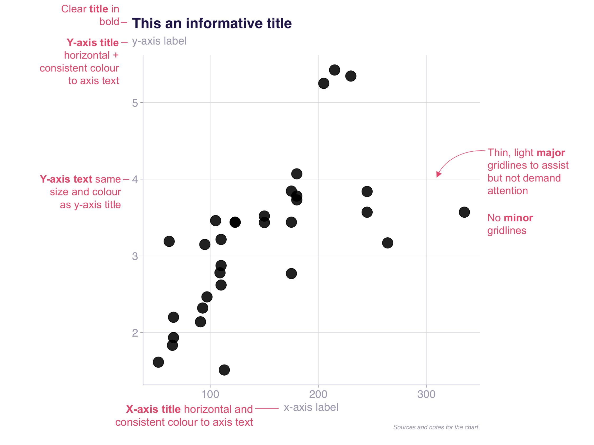
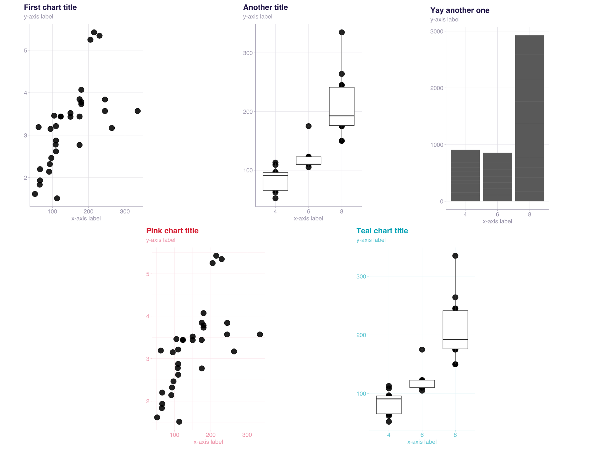
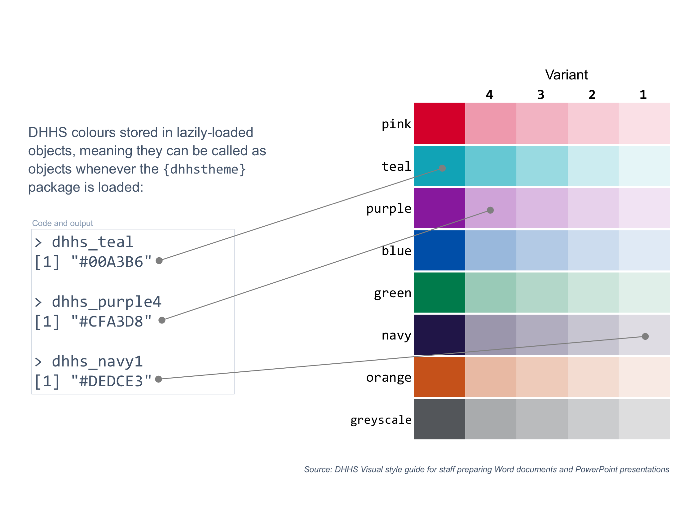
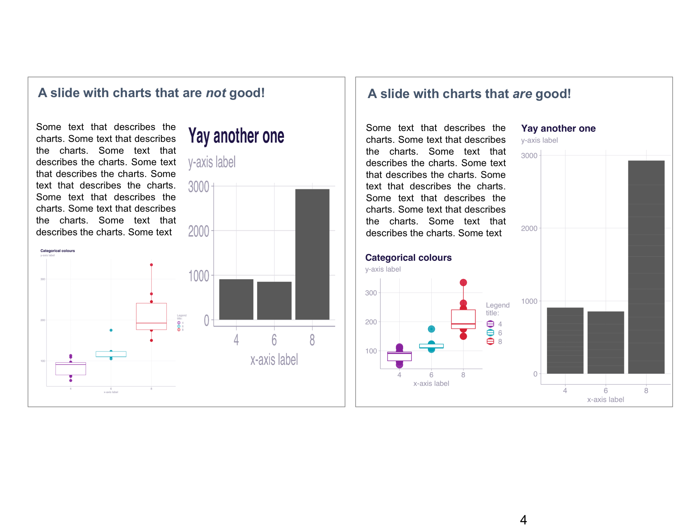
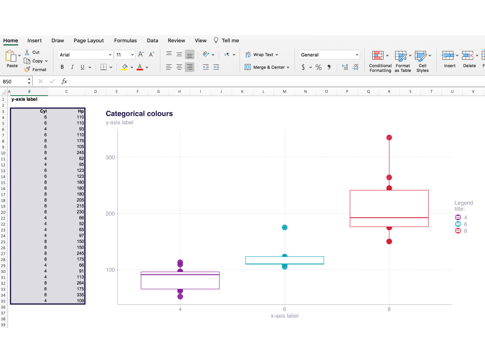

<!-- README.md is generated from README.Rmd. Please edit that file -->

# dhhstheme

<!-- badges: start -->

<!-- badges: end -->

**This package is under development and subject to change
substantially.** Use for exploration but not yet for production.

This package is designed to make DHHS-styled charts with the `ggplot2` R
package.

Please file an issue to report bugs or request features at
[wfmackey/dhhstheme/issues](https://github.com/wfmackey/dhhstheme/issues).

The package is currently maintained by Will Mackey, Jonathan Nolan and
Callum Shaw. It is based on and steals a lot of code from
[`grattantheme`](https://github.com/grattan/grattantheme) created by
Matt Cowgill and Will Mackey.

# The `dhhstheme` package

The `dhhstheme` package is designed to make it easier to generate
DHHS-style charts using the `ggplot2` package in R.

It has **four key features**:

  - **Theme**: provides a flexible {ggplot} theme to make
    consistent-looking charts
  - **Colour**: provides each colour in the DHHS palette and tools to
    use them
  - **Export plots**: tools to export plots for commonly-used DHHS
    slides
  - **Export plot data**: tools to export nicely-formatted data
    alongside plots

These features are demonstrated below.

# Installation and set up

The package is hosted on Github. To install a package from Github, use
the `install_github()` function from the `remotes` package:

``` r
install.packages("remotes")
remotes::install_github("wfmackey/dhhstheme")
```

Then load the package, along with the `tidyverse` package that contains
`ggplot2` and other data-manipulation tools:

``` r
library(dhhstheme)
library(tidyverse)
```

The package contains some COVID-19 data from [Our World in
Data](https://ourworldindata.org/coronavirus) for demonstrations. This
is loaded with the package in `owid_sample`:

``` r
glimpse(owid_sample)
#> Rows: 1,719
#> Columns: 12
#> $ country                  <chr> "Australia", "Australia", "Australia", "Aust…
#> $ continent                <chr> "Oceania", "Oceania", "Oceania", "Oceania", …
#> $ date                     <date> 2019-12-31, 2020-01-01, 2020-01-02, 2020-01…
#> $ new_cases                <dbl> 0, 0, 0, 0, 0, 0, 0, 0, 0, 0, 0, 0, 0, 0, 0,…
#> $ new_deaths               <dbl> 0, 0, 0, 0, 0, 0, 0, 0, 0, 0, 0, 0, 0, 0, 0,…
#> $ new_cases_per_million    <dbl> 0.000, 0.000, 0.000, 0.000, 0.000, 0.000, 0.…
#> $ new_deaths_per_million   <dbl> 0, 0, 0, 0, 0, 0, 0, 0, 0, 0, 0, 0, 0, 0, 0,…
#> $ total_cases              <dbl> 0, 0, 0, 0, 0, 0, 0, 0, 0, 0, 0, 0, 0, 0, 0,…
#> $ total_deaths             <dbl> 0, 0, 0, 0, 0, 0, 0, 0, 0, 0, 0, 0, 0, 0, 0,…
#> $ total_cases_per_million  <dbl> 0.000, 0.000, 0.000, 0.000, 0.000, 0.000, 0.…
#> $ total_deaths_per_million <dbl> 0, 0, 0, 0, 0, 0, 0, 0, 0, 0, 0, 0, 0, 0, 0,…
#> $ start_of_month           <lgl> FALSE, FALSE, FALSE, FALSE, FALSE, FALSE, FA…
```

# Theme

`dhhs_theme` provides a consistent look and feel for DHHS charts. The
default looks like this:

 While some elements –
like the base colour, minor gridlines and panel borders – are adjustable
from within the `dhhs_theme`, the theme maintains a consistent look:



## Making a basic bar chart using `theme_dhhs`

``` r
owid_sample %>% 
  filter(country == "Australia") %>% 
  ggplot(aes(date, new_cases)) + 
  geom_col(width = 1)
```


To add the DHHS theme, add `theme_dhhs`:

``` r
owid_sample %>% 
  filter(country == "Australia") %>% 
  ggplot(aes(date, new_cases)) + 
  geom_col(width = 1) +
  theme_dhhs()
```


You can use the pre-set DHHS colours (see next section) to `fill` the
plot, and add a DHHS y-axis:

``` r
owid_sample %>% 
  filter(country == "Australia") %>% 
  ggplot(aes(date, new_cases)) + 
  geom_col(width = 1,
           fill = dhhs_navy) +
  theme_dhhs() + 
  dhhs_y_continuous()
```


Finally, adding titles and labels:

``` r
aus_cases <- owid_sample %>% 
  filter(country == "Australia") %>% 
  ggplot(aes(date, new_cases)) + 
  geom_col(width = 1,
           fill = dhhs_navy) +
  theme_dhhs() +
  dhhs_y_continuous() +
  labs(title = "Australia's second wave",
       subtitle = "Daily COVID-19 cases in Australia",
       x = NULL,
       y = NULL,
       caption = "Source: Our World in Data (ourworldindata.org/coronavirus).")

aus_cases
```


# Colours

`dhhstheme` comes with lazily-loaded DHHS hex values. After `dhhstheme`
has been loaded with `library(dhhstheme)`, use a colour by typing
`dhhs_` and the colour name. E.g.:

``` r
dhhs_pink
#> [1] "#D50032"
dhhs_navy
#> [1] "#201547"
dhhs_blue
#> [1] "#004EA8"
dhhs_blue1
#> [1] "#E0EAF5"
```

The colours are sourced from the *DHHS Visual style guide for staff
preparing Word documents and Powerpoint presentations*. They are:



Two helper functions are provided to assist in selecting a colour
palette for your chart: `dhhs_colour_continuous()` and
`dhhs_fill_continuous()`. These can be used to assign colour or fill
`geoms` to a DHHS palette:

``` r
owid_sample %>% 
  filter(start_of_month,
         country %in% c("United States",
                        "Sweden",
                        "France")) %>% 
  ggplot(aes(total_cases_per_million, total_deaths_per_million,
             colour = country)) + 
  geom_point(size = 4) + 
  theme_dhhs(legend = "top") +
  dhhs_y_continuous() +
  dhhs_x_continuous(labels = scales::comma) + 
  dhhs_colour_manual(4) +
  labs(title = "More COVID-19 cases have led to more deaths",
       subtitle = "COVID-19 deaths per million population",
       x = "COVID-19 cases per million population",
       y = NULL,
       colour = NULL,
       caption = "Source: Our World in Data (ourworldindata.org/coronavirus).")
```


Alternatively, you can provide your own colour combinations using a
`value` argument:

``` r
owid_plot <- owid_sample %>% 
  filter(start_of_month,
         country %in% c("United States",
                        "Sweden",
                        "France")) %>% 
  ggplot(aes(total_cases_per_million, total_deaths_per_million,
             colour = country)) + 
  geom_point(size = 4) + 
  theme_dhhs(legend = "top", panel_borders = "border") +
  dhhs_y_continuous() +
  dhhs_x_continuous(labels = scales::comma) + 
  dhhs_colour_manual(values = c(dhhs_pink4, dhhs_green4, dhhs_blue4, dhhs_purple4)) +
  labs(title = "More COVID-19 cases have led to more deaths",
       subtitle = "COVID-19 deaths per million population",
       x = "COVID-19 cases per million population",
       y = NULL,
       colour = NULL,
       caption = "Source: Our World in Data (ourworldindata.org/coronavirus).")

owid_plot
```


## Saving a chart

The `dhhs_save` function is a wrapper around `ggsave` with pre-set sizes
and features commonly used in exporting charts at DHHS.

``` r
dhhs_save("data-raw/owid_plot.png", 
          plot_object = owid_plot)
#> Exporting plots for the large template
#>  - saving data-raw/owid_plot.png
```

This is designed to reduce ugly post-production re-sizing:



By default, this will save a ‘whole’ sized plot, which will fit the
whole **plotting** area of a DHHS Powerpoint slide. Often we will want
plots that cover half or a third of a slide, or to just cover the top or
bottom. We can use the `type` argument and one of nine pre-set sizes:

  - `"whole"`: The default. Use for a plot covering the whole body of a
    DHHS slide.
  - `"half"`: Use for a tall plot covering the full left or right side a
    normal DHHS slide.
  - `"third"`: Use for a tall plot covering roughly one-third of the
    horizontal space on a DHHS slide.
  - `"short-whole"`: Use for a short plot covering half the body of a
    DHHS slide.
  - `"short-half"`: Use for a short plot covering half of the left or
    right side of a DHHS slide.
  - `"short-third"`: Use for a short plot covering roughly one-third of
    the horizontal space on a normal DHHS slide.
  - `"all"`: Export all of the above in a folder called `file_path`.

For example:

``` r
dhhs_save("data-raw/owid_plot.png", 
          plot_object = owid_plot,
          type = "half")
#> Exporting plots for the large template
#>  - saving data-raw/owid_plot.png
```

Choosing ‘all’ will create a folder called `file_path` (sans extension)
and populate it with all possible chart types:

``` r
dhhs_save("data-raw/owid_plot.png", 
          plot_object = owid_plot,
          type = "all")
#> Exporting plots for the large template
#> Saving all types in data-raw/owid_plot
#>  - saving data-raw/owid_plot/owid_plot-whole.png
#>  - saving data-raw/owid_plot/owid_plot-half.png
#>  - saving data-raw/owid_plot/owid_plot-third.png
#>  - saving data-raw/owid_plot/owid_plot-short.png
#>  - saving data-raw/owid_plot/owid_plot-short-half.png
#>  - saving data-raw/owid_plot/owid_plot-short-third.png
#>  - exporting Excel data to: data-raw/owid_plot/owid_plot.xlsx
```

Additionally, because there are three commonly-used templates with
different sizes, you can tell `dhhs_save` the template you are using
with `ppt_size`. This takes one of three options:

  - `"large"`: for large Powerpoints with height 26.67 and width
    35.56cm.
  - `"normal43`: for standard 4:3 Powerpoints with height 19.05 and
    width 25.4cm.
  - `"normal169"`: for wide standard 16:9 Powerpoints with height 19.05
    and width 33.87cm.

These are applied alongside the `type` argument. For example, to save a
plot that takes up half the plotting area on the standard 16:9 DHHS
template:

``` r
dhhs_save("data-raw/owid_plot.png", 
          plot_object = owid_plot,
          type = "half",
          ppt_size = "normal169")
#> Exporting plots for the normal169 template
#>  - saving data-raw/owid_plot.png
```

# Exporting chart data

The `dhhs_save` function can create an Excel file that contains your
plot and the data used to make it. This can be called using the
`export_chartdata` argument:

``` r
dhhs_save("data-raw/owid_plot.png", 
          plot_object = owid_plot,
          export_chartdata = TRUE)
#> Exporting plots for the large template
#>  - saving data-raw/owid_plot/owid_plot-whole.png
#>  - exporting Excel data to: data-raw/owid_plot/owid_plot.xlsx
```

By default, this will export *only* the variables that are used in the
chart. To add additional variables, use the `add_vars` argument:

``` r
dhhs_save("data-raw/owid_plot.png", 
          plot_object = owid_plot,
          export_chartdata = TRUE, 
          add_vars = "date")
#> Exporting plots for the large template
#>  - saving data-raw/owid_plot/owid_plot-whole.png
#>  - exporting Excel data to: data-raw/owid_plot/owid_plot.xlsx
```

Which creates an Excel file with the variables
`total_cases_per_million`, `total_deaths_per_million`, `country` and
`date`:



# Exporting the data of multiple charts

The `save_chartdata` function, which is called by `dhhs_theme` when
exporting the Excel file, can be called directly. If you provide it with
a list of plots, it will create a single Excel file with a cover page
and one sheet per plot. For example:

``` r
save_chartdata("data-raw/owid_plot.xlsx", 
               object = list(owid_plot, aus_cases))
```

creates an Excel file with a cover page, adds a sheet for `owid_plot`,
then another for `aus_cases`:


